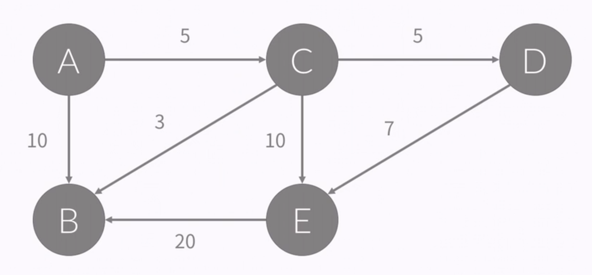

# 그래프

### 그래프 (Graph)

- 자료구조의 일종
- 정점(Node, Vertex)
- 간선(Edge): 정점 간의 관계를 나타낸다.
- G = (V, E)로 나타낸다.

### 경로 (path)

- 정점 A에서 B로 가는 경
- A -> C -> D -> E -> B
- A -> B
- A -> C -> B
- A -> C -> E -> B

### 사이클 (cycle)

- 정점 A에서 다시 A로 돌아오는 경로 
- 경로 중에서 시작 = 도착인 것

- A -> C -> B -> A
- A -> C -> E -> B -> A
- A -> C -> D -> E -> B -> A

### 단순 경로와 단순 사이클 (Simple Path and Simple Cycle)

- 경로/사이클에서 같은 정점을 두 번 이상 방문하지 않는 경로/사이클
- 특별한 말이 없으면, 일반적으로 사용하는 경로와 사이클은 단순 경로/사이클을 말한다.

### 방향 있는 그래프 (Directed Graph)

- A -> C 와 같이 간선에 방향이 있다.
- A -> C는 있지만, C -> A는 없다.

### 방향 없는 그래프 (Undirected Graph)

- A - C 와 같이 간선에 방향이 없다.
- A - C는 A -> C와 C -> A를 나타낸다.
- 양방향 그래프(Bidirection Graph)라고도 한다.

### 간선 여러개 (Multiple Edge)

- 두 정점 사이에 간선이 여러 개일수도 있다.
- 위 그림의 A-B는 연결하는 간선이 2개이다.
- 두 간선은 서로 다른 간선이다.

### 루프 (Loop)

- 간선의 양 끝 점이 같은 경우가 있다.
- A -> A

### 가중치 (Weight)

- 간선에 가중치가 있는 경우에는
- A에서 B로 이동하는 거리, 이동하는데 필요한 시간, 이동하는데 필요한 비용 등등등...
- 가중치가 없는 경우에는 1이라고 생각하면 된다. 

### 차수 (Degree)

- 정점과 연결되어 있는 간선의 개수
- 5의 차수: 3
- 4의 차수: 4

