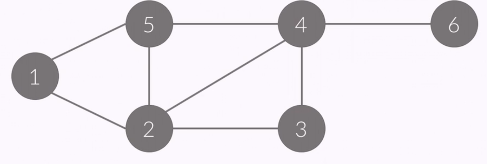
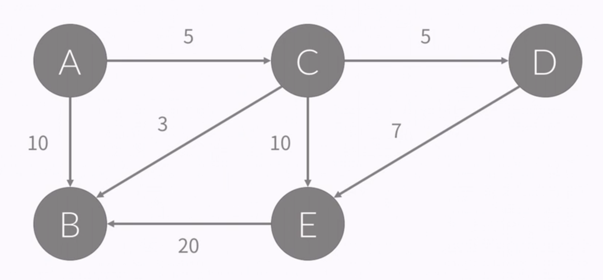
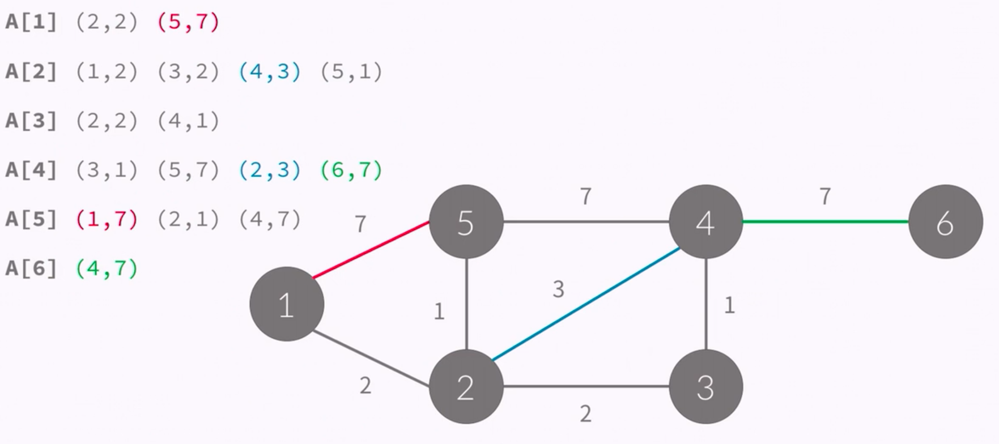
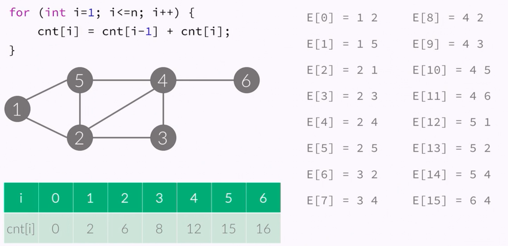
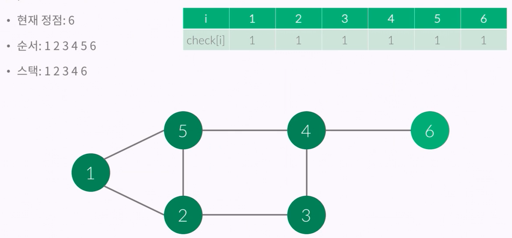
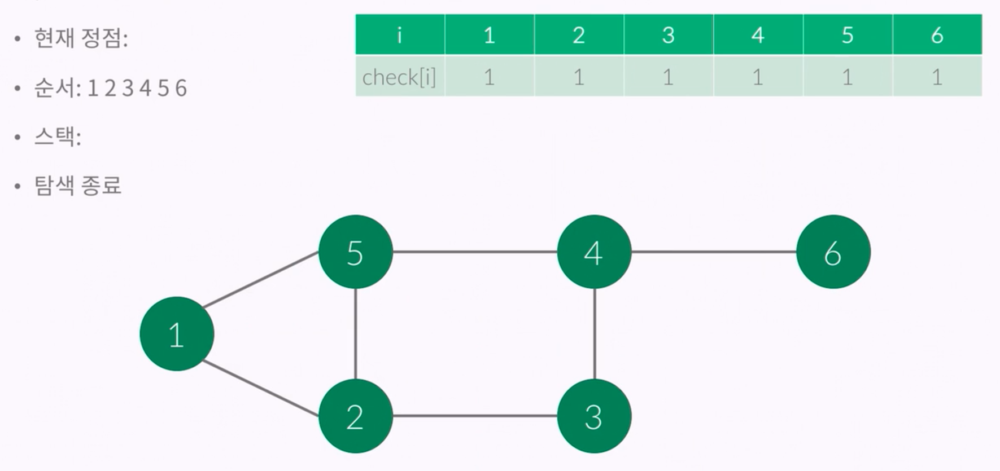
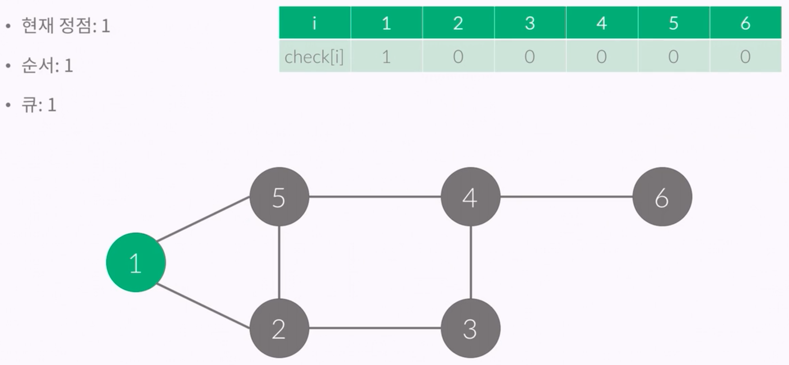
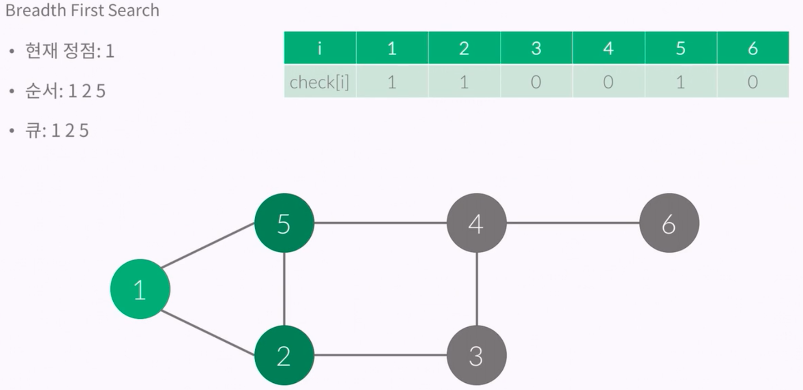

# 그래프의 표현 (Representation of Graph)

### 그래프의 표현

- 아래와 같은 그래프는 정점이 6개, 간선이 8개 있다.
- 간선에 방향이 없기 떄문에, 방향이 없는 그래프이다.
- 정점 : {1,2,3,4,5,6}
- 간선 : {(1,2),(1,5),(2,5),(2,3),(3,4),(2,4),(4,5),(4,6)}

> 6 8 # n m (정점의 개수, 간선의 개수)
- 1 2
- 1 5
- 2 3
- 2 4
- 2 5
- 5 4
- 4 3
- 4 6




### 인접 행렬 (Adjacency-matrix)

- 정점의 개수를 V이라고 했을때
- V X V 크기의 이차원 배열을 이용한다.
- A[i][j] = 1 (i -> j 간선이 있을 때), 0(없을 때)


```
#include <cstdio>
#include <vector>
int a[10][10];
int main() {
    int n, m;
    scanf("%d %d", &n,&m);
    for (int i = 0; i < m; i++) {
        int u, v;
        a[u][v] = a[v][u] = 1;
    }
}
```


### 인접 행렬 - 가중치

- 정점의 개수를 N이라고 했을 때
- N X N 크기의 이차원 배열을 이용한다
- A[i][j] = w (i -> j 간선이 있을 때, 그 가중치), 0(없을때)



```
#include <cstdio>
#include <vector>
int a[10][10];
int main() {
    int n, m;
    scanf("%d %d", &n,&m);
    for (int i = 0; i < m; i++) {
        int u, v, w;
        scanf("%d %d %d", &u, &v, &w);
        a[u][v] = a[v][u] = w;
    }
}
```


### 인접 리스트 (Adjacency-list)

- 링크드 리스트를 이용해서 구현한다.
- A[i] = i와 연결된 정점을 링크드 리스트로 포함하고 있음


- 링크드 리스트는 구현하는데 시간이 오래걸리기 떄문에, 주로 vector와 같이 길이를 변경할 수 있는 배열을 이용해서 구현한다.

````
#include <cstdio>
#include <vector>
using namespace std;
vector<int> a[10];
int main() {
    int n, m;
    scanf("%d %d",&n,&m);
    for (int i = 0; i < m; i++) {
        int u,v;
        scanf("%d %d",&u,&v);
        a[u].push_back(v); a[v].push_back(u);
    }
}
````


### 인접 리스트 - 가중치

- 링크드 리스트를 이용해서 구현한다.
- A[i] = i와 연결된 정점과 그 간선의 가중치를 링크드 리스트로 포함하고 있음




### 공간 복잡도

- 인접 행렬: O(V^2)
- 인접 리스트: O(E)


### 간선 리스트 (Edge-list)

- 배열을 이용해서 구현한다.
- 간선을 모두 저장하고 있다.
- E라는 배열에 간선을 모두 저장



````
for (int i = 1; i<=n; i++) {
    cnt[i] = cnt[i-1] + cnt[i[;
}
````


### 그래프의 탐색

- 목적: 모든 정점을 1번씩 방문
- DFS: 깊이 우선 탐색 
    - 최대한 깊숙히 많이
    - 스택
    
- BFS: 너비 우선 탐색 
    - 최대한 넓게 가는 것
    - 큐
    - 모든 가중치가 1인 경우 최단거리를 찾는 알고리즘 
    
    
### 깊이 우선 탐색 (Depth First Search)

- 스택을 이용해서 갈 수 있는만큼 최대한 많이 가고
- 갈 수 없으면 이전 정점으로 돌아간다. 
- 모든 정점을 1번씩 방문
- check[i] : 0 또는 1
    - 0 : 아직 방문X
    - 1 : 방문



- 스택에서 하나씩 pop하면서 돌아간다.




### 깊이 우헌 탐색 구현

- 재귀 호출을 이용해서 구현할 수 있다.
- dfs(x): x를 방문

> 인접 행렬을 이용한 구현

````
void dfs (int x) {
    check[x] = true;
    printf("%d ", x);
    for (int i=1; i<=n; i++) {
        if (a[x][i] == 1 && check[i] == false) {
            dfs(i);
        }
    }
}
````

> 인접 리스트를 이용한 구현

````
void dfs(int x) {
    check[x] = true;
    printf("%d ", x);
    for (int i=0; i < a[x].size(); i++) {
        int y = a[x][i];
        if (check[y] == false) {
            dfs(y);
        }
    }
}
````


### 너비 우선 탐색 (Breadth First Search)

- 큐를 이용해서 지금 위치에서 갈 수 있는 것을 모두 큐에 넣는 방식
- 큐에 넣을 때 방문했다고 체크해야한다.




- BFS의 구현은 Queue를 이용해서 할 수 있다. (인접 행렬)

````
queue<int> q;
check[1] = true; q.push(1);

while (!q.empty()) {
    int x = q.front(); q.pop();
    printf("%d ", x);
    for (int i=1; i<=n; i++) {
        if (a[x][i] == 1 && check[i] == false) {
            check[i] = true;
            q.push(i);
        }
    }
}
````

- BFS의 구현은 Queue를 이용해서 할 수 있다. (인접 리스트)


```
queue<int> q;
check[1] = true; q.push(1);
while (!q.empty()) {
    int x = q.front(); q.pop();
    printf("%d ",x);
    for (int i=0; i<a[x].size(); i++) {
        int y = a[x][i];
        if (check[y] == false) {
            check[y] = true; q.push(y);
        }
    }
}
```

- 인접 행렬: O(V^2)
- 리스트: O(V+E)