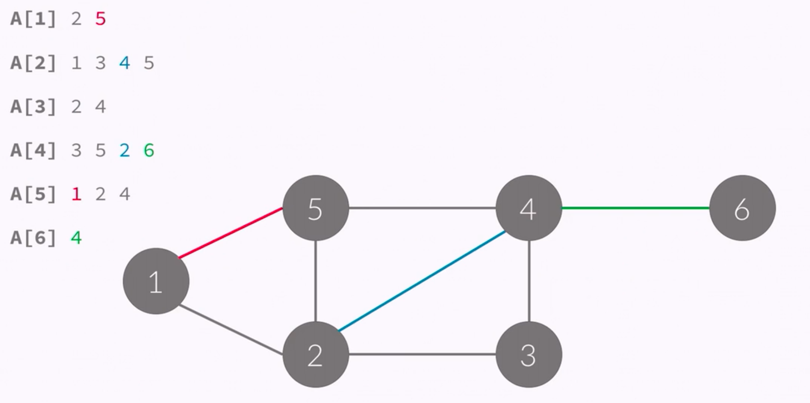

# 그래프의 표현 (Representation of Graph)

### 그래프의 표현

- 아래와 같은 그래프는 정점이 6개, 간선이 8개 있다.
- 간선에 방향이 없기 떄문에, 방향이 없는 그래프이다.
- 정점 : {1,2,3,4,5,6}
- 간선 : {(1,2),(1,5),(2,5),(2,3),(3,4),(2,4),(4,5),(4,6)}

> 6 8 # n m (정점의 개수, 간선의 개수)
- 1 2
- 1 5
- 2 3
- 2 4
- 2 5
- 5 4
- 4 3
- 4 6


### 인접 행렬 (Adjacency-matrix)

- 정점의 개수를 V이라고 했을때
- V X V 크기의 이차원 배열을 이용한다.
- A[i][j] = 1 (i -> j 간선이 있을 때), 0(없을 때)


```
#include <cstdio>
#include <vector>
int a[10][10];
int main() {
    int n, m;
    scanf("%d %d", &n,&m);
    for (int i = 0; i < m; i++) {
        int u, v;
        a[u][v] = a[v][u] = 1;
    }
}
```


### 인접 행렬 - 가중치

- 정점의 개수를 N이라고 했을 때
- N X N 크기의 이차원 배열을 이용한다
- A[i][j] = w (i -> j 간선이 있을 때, 그 가중치), 0(없을때)


```
#include <cstdio>
#include <vector>
int a[10][10];
int main() {
    int n, m;
    scanf("%d %d", &n,&m);
    for (int i = 0; i < m; i++) {
        int u, v, w;
        scanf("%d %d %d", &u, &v, &w);
        a[u][v] = a[v][u] = w;
    }
}
```


### 인접 리스트 (Adjacency-list)

- 링크드 리스트를 이용해서 구현한다.
- A[i] = i와 연결된 정점을 링크드 리스트로 포함하고 있음



- 링크드 리스트는 구현하는데 시간이 오래걸리기 떄문에, 주로 vector와 같이 길이를 변경할 수 있는 배열을 이용해서 구현한다.

````
#include <cstdio>
#include <vector>
using namespace std;
vector<int> a[10];
int main() {
    int n, m;
    scanf("%d %d",&n,&m);
    for (int i = 0; i < m; i++) {
        int u,v;
        scanf("%d %d",&u,&v);
        a[u].push_back(v); a[v].push_back(u);
    }
}
````


### 인접 리스트 - 가중치

- 링크드 리스트를 이용해서 구현한다.
- A[i] = i와 연결된 정점과 그 간선의 가중치를 링크드 리스트로 포함하고 있음


### 공간 복잡도

- 인접 행렬: O(V^2)
- 인접 리스트: O(E)


### 간선 리스트 (Edge-list)

- 배열을 이용해서 구현한다.
- 간선을 모두 저장하고 있다.
- E라는 배열에 간선을 모두 저장


````
for (int i = 1; i<=n; i++) {
    cnt[i] = cnt[i-1] + cnt[i[;
}
````


### 그래프의 탐색

- DFS: 깊이 우선 탐색
- BFS: 너비 우선 탐색 